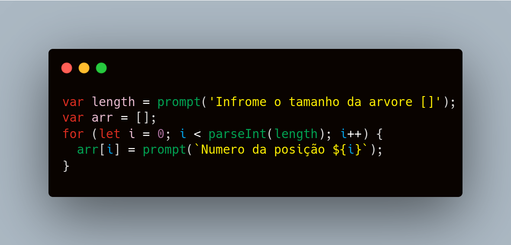
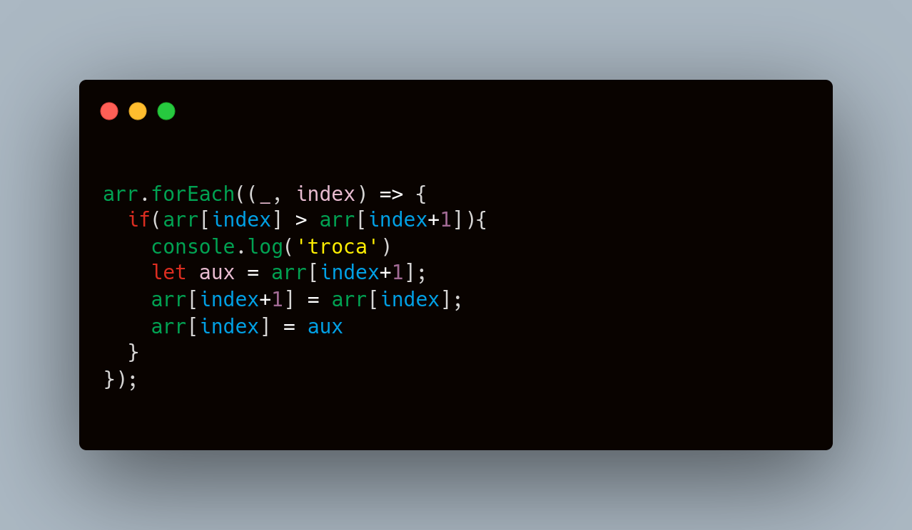
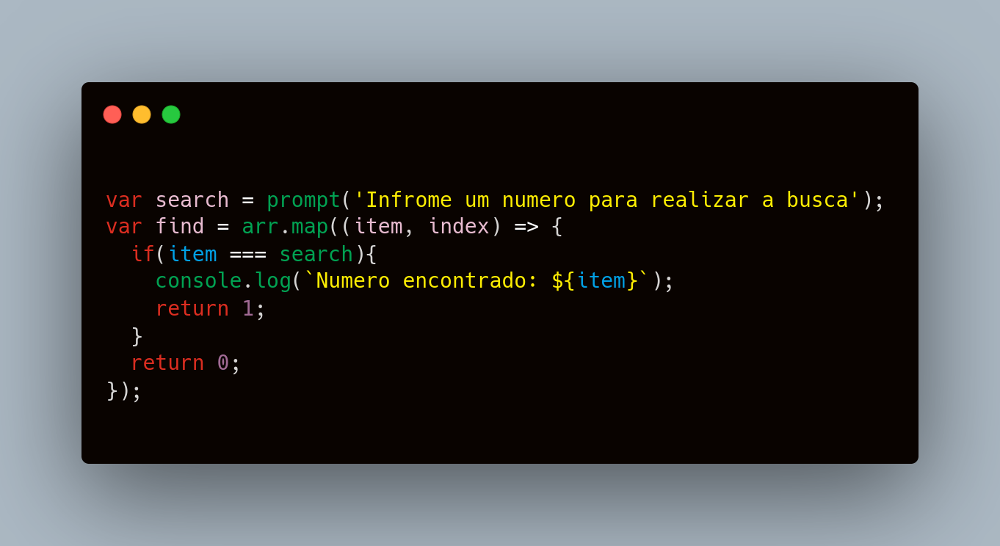

# ❓ breadth Search 

An algorithm for performing breadth-first searches on a user-given array

## ⚠️ Partials Codes

First we make the algorithm ask the user for the size of the array ()
<code>

</code>

Then we perform the exchange of elements sorting in an increasing array sort()
<code>

</code>

Finally, we run a find, where we ask the user for the number he wants to look for in the array and return a success message if found.
<code>

</code>
